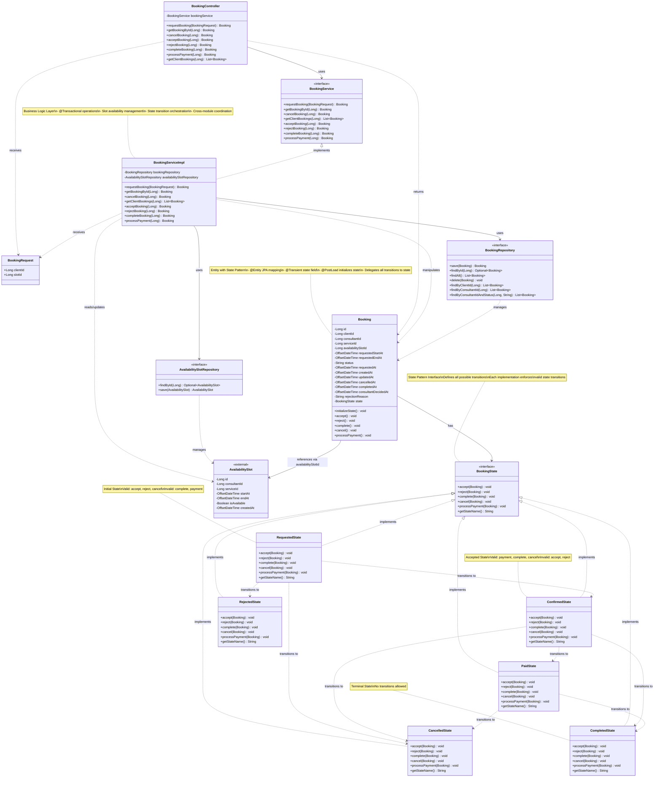
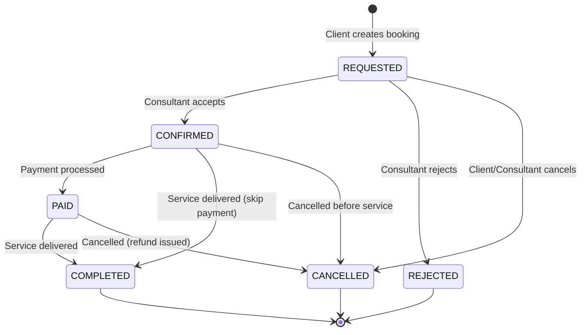

# Booking Module - Class Diagram



## Relationships Explained

### 1. **Composition** (Solid line with filled diamond)
- `BookingServiceImpl` ◆→ `BookingRepository`: Service owns/manages repository
- `BookingServiceImpl` ◆→ `AvailabilitySlotRepository`: Service owns/manages repository

### 2. **Association** (Solid line with arrow)
- `BookingController` → `BookingService`: Controller uses service
- `Booking` → `BookingState`: Booking has a state

### 3. **Dependency** (Dashed line with arrow)
- `BookingController` ⋯→ `BookingRequest`: Controller depends on DTO
- `BookingServiceImpl` ⋯→ `Booking`: Service manipulates entity
- State classes ⋯→ Other States: State transitions

### 4. **Implementation** (Dashed line with hollow triangle)
- `BookingServiceImpl` ⊳⋯ `BookingService`: Implements interface
- All state classes ⊳⋯ `BookingState`: Implement state interface

### 5. **Reference** (Association)
- `Booking` → `AvailabilitySlot`: Foreign key reference via `availabilitySlotId`

## State Transition Flow



## Package Structure

```
com.consultingplatform.booking/
│
├── domain/
│   └── Booking.java (Entity)
│
├── repository/
│   └── BookingRepository.java (Data Access)
│
├── service/
│   ├── BookingService.java (Interface)
│   └── BookingServiceImpl.java (Implementation)
│
├── web/
│   ├── BookingController.java (REST API)
│   └── BookingRequest.java (DTO)
│
└── state/ (State Pattern)
    ├── BookingState.java (Interface)
    ├── RequestedState.java
    ├── ConfirmedState.java
    ├── PaidState.java
    ├── CompletedState.java
    ├── CancelledState.java
    └── RejectedState.java
```

## Key Design Patterns

1. **State Pattern** - Booking state management
2. **Repository Pattern** - Data access abstraction
3. **Service Layer Pattern** - Business logic separation
4. **DTO Pattern** - BookingRequest for API input
5. **Dependency Injection** - Constructor injection throughout

## Cross-Module Dependencies

- **Consultant Module**: `AvailabilitySlot` and `AvailabilitySlotRepository`
  - Used for slot validation and availability management
  - Ensures no double-booking
  - Auto-populates booking details from slot
